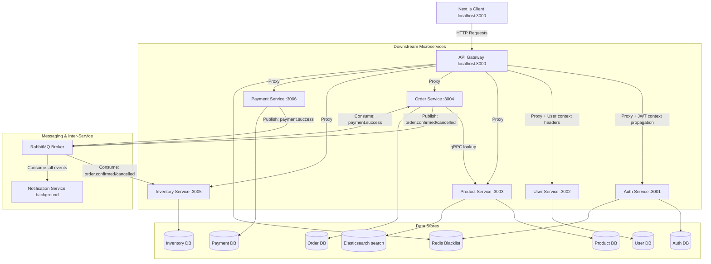
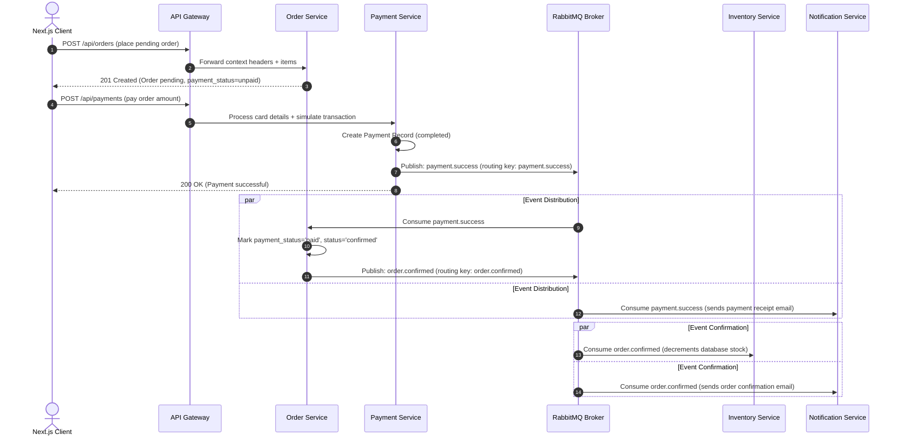

# ShopStack: E-Commerce Microservice Platform

ShopStack is a full-featured, distributed e-commerce application architected around 8 independently deployable microservices and a polished Next.js single-page application dashboard. The project demonstrates advanced microservice patterns, database isolation, eventual consistency, API gateway integration, and asynchronous event-driven message architectures.

---

## 🏗 System Architecture & Network Topology

All downstream microservices are fully isolated behind a central API Gateway and communicate asynchronously via a RabbitMQ message broker or synchronously via gRPC (for product lookups from the order service).



---

## 🛠 Service Topology Registry

| Service Name | External Port | Internal Address | Datastore | Communication / Protocol |
| :--- | :--- | :--- | :--- | :--- |
| **API Gateway** | `8000` | `http://api-gateway:8000` | Redis (Shared) | Reverse Proxy, Rate limiting, CORS, Context Headers |
| **Frontend UI** | `3000` | `http://frontend:3000` | LocalStorage / Cookies | Next.js App Router, Axios client |
| **Auth Service** | `3001` | `http://auth-service:3001` | PostgreSQL, Redis | Express, JWT signature key, Token blacklisting |
| **User Service** | `3002` | `http://user-service:3002` | PostgreSQL | Profile storage, addresses, internal address resolve API |
| **Product Service**| `3003` | `http://product-service:3003` | PostgreSQL, Elasticsearch | gRPC server (port `50051`), search catalog caching |
| **Order Service** | `3004` | `http://order-service:3004` | PostgreSQL | gRPC client, RabbitMQ publisher, RabbitMQ subscriber |
| **Inventory Service**| `3005` | `http://inventory-service:3005` | PostgreSQL | RabbitMQ subscriber (stock deduction/returns) |
| **Payment Service**| `3006` | `http://payment-service:3006` | PostgreSQL | HTTP checkout, RabbitMQ publisher (`payment.success`) |
| **Notification** | — | — | SMTP (Mailtrap / Ethereal) | RabbitMQ subscriber (sends transactional emails) |

---

## ⚡ Asynchronous Event Workflows

### 1. Event-Driven Order Checkout Sequence



---

## 🚀 Quick Start Guide

### Prerequisites
- Install **Docker** and **Docker Compose**
- Make sure ports `3000`, `8000`, `9200`, `15672`, and `5432` are not occupied.

### Initial Configuration
Copy the sample environment variables:
```bash
cp .env.example .env
```

### Spin up the Containers
Boot the entire multi-container topology using compose:
```bash
docker compose up -d --build
```
This builds and runs 13 containers including PostgreSQL, Redis, RabbitMQ, Elasticsearch, and all microservices.

### Access URLs
- **Web App Dashboard:** [http://localhost:3000](http://localhost:3000)
- **API Gateway:** [http://localhost:8000](http://localhost:8000)
- **RabbitMQ Management Dashboard:** [http://localhost:15672](http://localhost:15672) (User: `guest` / Pass: `guest`)
- **Elasticsearch status:** [http://localhost:9200](http://localhost:9200)

---

## 💳 Simulated Payments Checkout Helper

The checkout form simulates card processing. Use these numbers during checkout to test different workflows:

| Card Number | Expiry | CVV | Expected Simulator Action |
| :--- | :--- | :--- | :--- |
| `4242 4242 4242 4242` | MM/YY | *Any* | **Successful Transaction** (Transition to Confirmed, Stock deducted, Email sent) |
| `4242 4242 4242 9999` | MM/YY | `999` | **Decline / Failed Transaction** (Throws validation error, keeps order unpaid/pending) |
